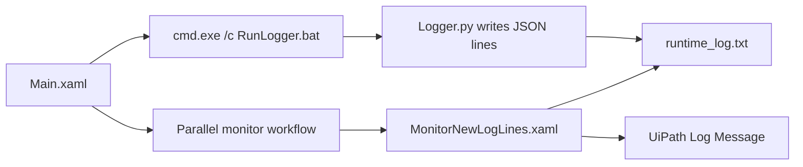

# Add Python Custom Logs

UiPath RPA sample project that brings logs from an external Python script back into the UiPath job log.

## Overview

RPA processes often call external scripts, batch files, command-line tools, or legacy applications. Those external components can produce useful runtime information, but their logs usually sit outside the UiPath execution trail.

This project demonstrates a lightweight observability pattern:

1. UiPath starts a Python script through a batch file.
2. The Python script writes structured JSON log records to `runtime_log.txt`.
3. UiPath stores the current log-file line count before the script starts.
4. While the script is running, UiPath polls the log file for new records.
5. New external log records are parsed with UiPath JSON activities.
6. Parsed messages are written into the UiPath workflow log with the matching log level.
7. UiPath performs one final scan after the external script window closes.

This lets the UiPath job log show what happened inside the external script without replaying old log lines from previous runs.

## Project Structure

```text
.
├── Main.xaml
├── MonitorNewLogLines.xaml
├── Parallel logging till scipt executes.xaml
├── README.md
├── entry-points.json
├── hashnode-uipath-external-script-observability.md
├── project.json
├── project.uiproj
└── Python scripts
    ├── Logger.py
    ├── RunLogger.bat
    └── test_logger.py
```

`runtime_log.txt` is generated by the Python script at runtime. `__pycache__` folders are Python-generated artifacts and should normally be ignored in Git.

> Note: `Parallel logging till scipt executes.xaml` is the actual workflow filename in this project. If you rename it, update the Invoke Workflow File activity in `Main.xaml` as well.

## How It Works



### Main.xaml

`Main.xaml` is the process entry point. It:

- Sets `batFilePath` to `Python scripts\RunLogger.bat`.
- Sets `logFilePath` to `Python scripts\runtime_log.txt`.
- Captures the existing line count in `runtime_log.txt` into `lineCursor`.
- Starts `cmd.exe` with `/c "<batFilePath>"`.
- Uses `Path.GetDirectoryName(batFilePath)` as the working directory.
- Invokes `Parallel logging till scipt executes.xaml` with `logFilePath` and `lineCursor`.

The cursor matters because it prevents old log records from being written again during a new robot run.

### Parallel Monitor Workflow

`Parallel logging till scipt executes.xaml` coordinates monitoring while the Python script is running.

It has two parallel branches:

- One branch checks whether the command prompt window is still visible.
- The other branch invokes `MonitorNewLogLines.xaml` repeatedly while the script is running.

The current workflow uses:

- `pollDelay = TimeSpan.FromSeconds(5)` for log-file polling.
- `stateCheckDelay = TimeSpan.FromMinutes(2)` between command prompt state checks.
- UiPath UI Automation `NCheckState` activities to detect the Windows Terminal command prompt window.

After the command prompt closes, the workflow invokes `MonitorNewLogLines.xaml` one more time to capture any final records.

### MonitorNewLogLines.xaml

`MonitorNewLogLines.xaml` is the reusable log reader. It:

- Reads the current log file snapshot.
- Skips records before `lineCursor`.
- Handles truncated or rotated log files by resetting the cursor.
- Parses each new JSON log record with the UiPath `DeserializeJson` activity.
- Uses `Newtonsoft.Json.Linq.JObject` to inspect the parsed record.
- Requires `loglevel` and `message` to exist and be strings.
- Routes the message to a UiPath Log Message activity using the parsed level.
- Advances `lineCursor` to the latest processed line.

Invalid JSON records, missing fields, unsupported log levels, or non-string values are written as UiPath error logs with the raw line included.

### Python Logger

`Python scripts/Logger.py` writes one JSON record every 5 seconds for up to 12 hours by default.

Example log record:

```json
{"timestamp":"2026-05-26T12:00:00+00:00","loglevel":"Error","message":"Script is running"}
```

Current defaults in `Logger.py`:

| Setting | Value |
|---|---|
| `LOG_FILE_NAME` | `runtime_log.txt` |
| `LOG_INTERVAL_SECONDS` | `5` |
| `RUN_DURATION_SECONDS` | `12 * 60 * 60` |
| `LOG_LEVEL` | `Error` |
| `MESSAGE` | `Script is running` |

## Log Level Mapping

The UiPath workflow maps external log levels to UiPath log levels.

| External value | UiPath log level |
|---|---|
| `TRACE` | `Trace` |
| `INFO` | `Info` |
| `INFORMATION` | `Info` |
| `WARN` | `Warn` |
| `WARNING` | `Warn` |
| `ERROR` | `Error` |
| `FATAL` | `Fatal` |

The Python log record also includes a `timestamp`, but the current UiPath workflow only uses `loglevel` and `message` when writing to the UiPath job log.

## Prerequisites

- Windows machine
- UiPath Studio `25.10.1` or compatible
- Python 3 installed and available through the `python` command
- UiPath project dependencies restored from `project.json`

Current UiPath dependencies:

- `UiPath.System.Activities` `[25.10.2]`
- `UiPath.UIAutomation.Activities` `[25.10.16]`
- `UiPath.WebAPI.Activities` `2.4.0`

`UiPath.WebAPI.Activities` is used for the JSON deserialization activity in `MonitorNewLogLines.xaml`.

## Setup

1. Clone or download this repository.
2. Open the project in UiPath Studio.
3. Restore project dependencies if Studio does not restore them automatically.
4. Update these variables in `Main.xaml` if the project is cloned to a different folder:

```text
batFilePath
logFilePath
```

The sample currently points these variables to a local project path. For a shared repository, update them to match your local checkout or refactor them to use a project-relative path.

5. Confirm Python runs from a terminal:

```powershell
python --version
```

6. If your machine opens Command Prompt differently than this sample, update the `NCheckState` target in `Parallel logging till scipt executes.xaml` so it detects the script window correctly.

## Running the Sample

### Run from UiPath Studio

1. Open `Main.xaml`.
2. Run the process.
3. The process starts `cmd.exe /c RunLogger.bat`, which runs `Logger.py`.
4. UiPath monitors `runtime_log.txt` while the command prompt window is visible.
5. New Python log records appear in the UiPath job log.

### Run the Python logger directly

From the project root:

```powershell
cd "Python scripts"
python Logger.py
```

This writes records to:

```text
Python scripts/runtime_log.txt
```

## Running Python Tests

The Python logger has unit tests for the log-file path, JSON log format, and batch-file launcher contract.

From the project root:

```powershell
python -m unittest discover -s "Python scripts" -p "test_logger.py"
```

## Key Implementation Notes

- The log file is append-only during normal execution.
- `lineCursor` tracks how many log lines have already been processed.
- Repeated identical log messages are preserved because the workflow filters by line position, not by message content.
- If the log file is truncated or rotated, the workflow resets the cursor to `0`.
- JSON parsing is implemented with UiPath activities rather than custom inline parsing code.
- The final scan after process exit reduces the chance of missing the last records written by the external script.
- The batch file changes into its own folder before running Python, which keeps relative file output predictable.

## When to Use This Pattern

Use this pattern when a UiPath automation calls an external component and you want that component's runtime logs visible in the UiPath execution trail.

Good candidates include:

- Python scripts
- Batch files
- PowerShell scripts
- Console applications
- Vendor command-line tools
- Long-running helper processes
- Legacy applications that write local logs

## Repository Hygiene

For a production GitHub repository, consider excluding generated runtime files:

```gitignore
Python scripts/runtime_log.txt
Python scripts/__pycache__/
```

Keep `runtime_log.txt` only if you want to provide a sample output file.

## Related Article

This repository includes a publish-ready article draft:

```text
https://jdoshi2091.hashnode.dev/making-external-script-execution-observable-in-uipath
```

The article explains the customer problem, the observability gap, and the file-based log bridge pattern used in this project.
